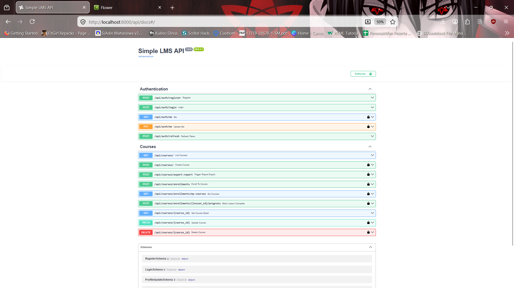
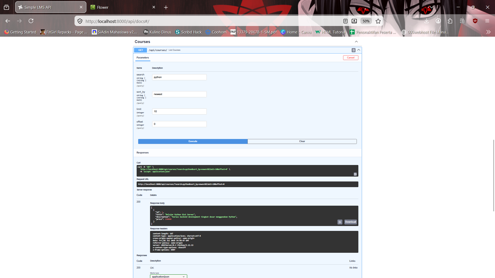
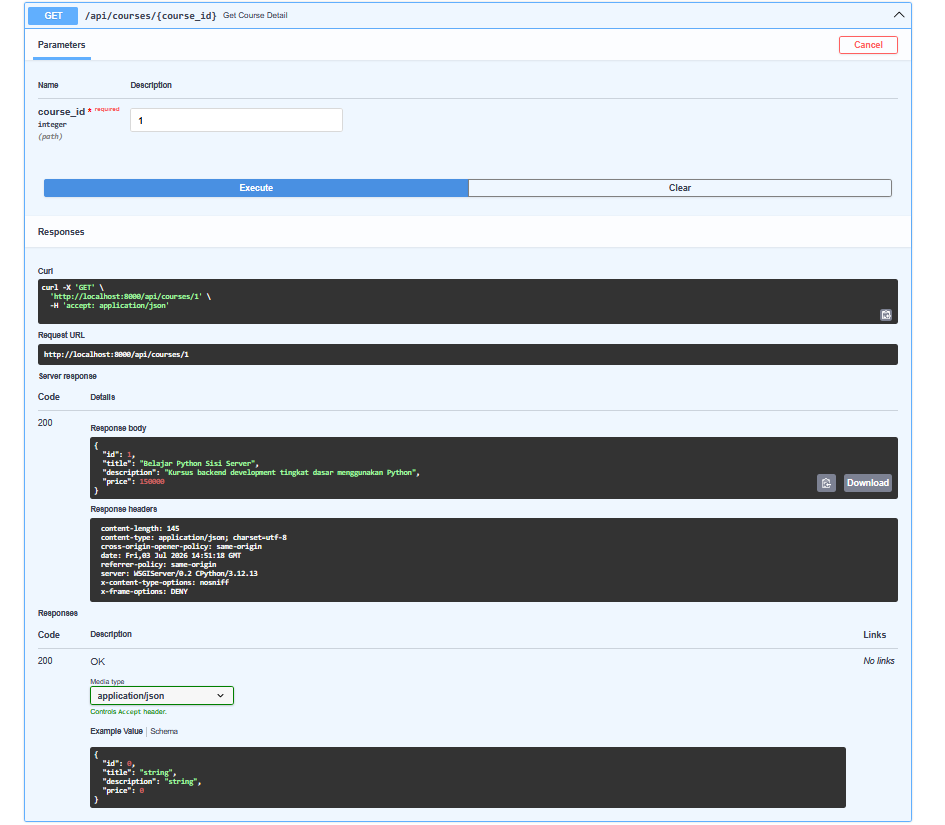
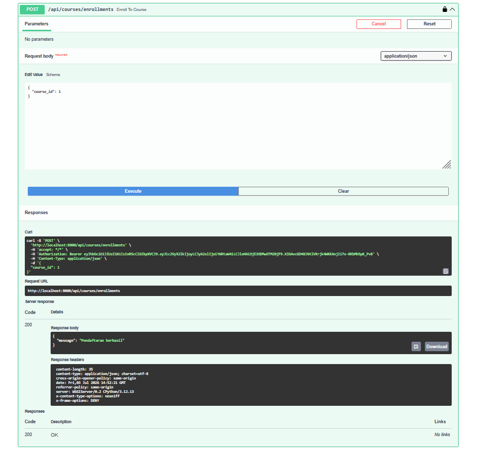
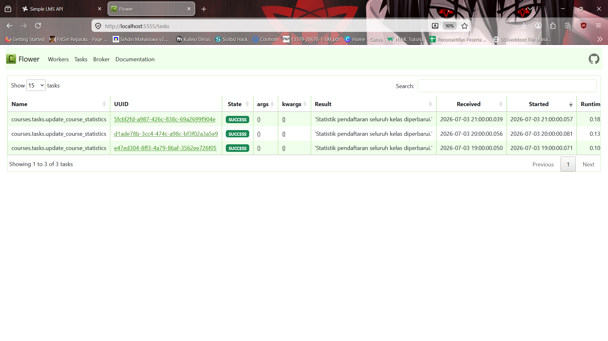

# Laporan Final Project: Simple LMS Extended Backend

### Identitas Pengembang
* **Nama**: Kevin Korhan Arrizky
* **NIM**: A11.2022.14318
* **Kelas**: Pemrograman Sisi Server
* **Program Studi**: Teknik Informatika 
* **Dosen Pengajar**: Fahri Firdausillah, S.Kom, M.CS
* **URL Repository**: https://github.com/Kevinkorhana/Pemsis

---

## 1. Deskripsi Project
Project ini merupakan pengembangan lanjutan dari *Simple Learning Management System (LMS)* menggunakan arsitektur modern *multi-container orchestration*. Backend dibangun menggunakan framework **Django dengan Django Ninja REST API**, serta didukung oleh **PostgreSQL** sebagai database utama, **Redis** untuk manajemen cache, **MongoDB** untuk pencatatan log aktivitas, serta **Celery + RabbitMQ** untuk menangani antrean tugas asinkronus dan terjadwal (*background & scheduled tasks*).

## 2. Fitur Dasar yang Sudah Berjalan
* **Authentication**: Autentikasi aman menggunakan JWT Tokens (`AuthBearer`).
* **Role-Based Access Control (RBAC)**: Pembatasan hak akses berbasis peran untuk Admin, Instructor, dan Student.
* **Core LMS Endpoints**: Manajemen data Course, Lesson, Enrollment, dan Progress tracking.
* **Auto-Generated Documentation**: Swagger/OpenAPI interaktif diakses melalui `/api/docs`.
* **Multi-Container Environment**: Menggunakan Docker dan Docker Compose untuk mengisolasi lingkungan pengembangan sistem.
* **Relational Database System**: Django project yang terintegrasi secara penuh dengan database PostgreSQL untuk persistensi data utama.
* **LMS Core Models Data Structure**: Implementasi lengkap model-model utama yang saling berelasi, yaitu: `User`, `Category`, `Course`, `Lesson`, `Enrollment`, dan `Progress`.
* **Modern REST API Architecture**: Pembangunan seluruh endpoint API menggunakan framework Django Ninja untuk performa eksekusi yang cepat dan validasi skema otomatis.
* **Secure JWT Authentication**: Sistem pengamanan data dan session pengguna menggunakan mekanisme JWT (JSON Web Token) via dekorator kustom `AuthBearer`.
* **LMS Fundamental Endpoints**: Ketersediaan API endpoint dasar yang matang untuk manajemen siklus hidup `course`, proses `enrollment`, serta pelacakan `progress` materi.

## 3. Fitur Tambahan yang Dipilih (Paket 4 - Performance & API Quality)

| No | Fitur Tambahan                           | Kategori              | Poin | Status                   |
|----|------------------------------------------|-----------------------|------|--------------------------|
| 1  | Redis caching untuk course               | D. Redis & Caching    | 12   | Selesai                  |
| 2  | Cache invalidation strategy              | D. Redis & Caching    | 12   | Selesai                  |
| 3  | Filter, search, sort, pagination lengkap | I. API Quality        | 12   | Selesai                  |
| 4  | Email notification async via Celery      | F. Celery & Async     | 12   | Selesai                  |
| 5  | Flower monitoring                        | F. Celery & Async     | 8    | Selesai                  |
| **Total Poin**                                | **56 Poin**           | **Maksimal (50 Poin)**          |

## 4. Penjelasan Implementasi Fitur Tambahan

*   **1. Redis caching untuk course**: Mengurangi latensi pembacaan database PostgreSQL pada endpoint detail kursus (`GET /api/courses/{course_id}`) dengan menyimpan datanya ke dalam memori RAM Redis selama 15 menit sehingga mempercepat respons server saat diakses berulang kali.
*   **2. Cache invalidation strategy**: Menerapkan fungsi helper `clear_course_cache()` yang otomatis menghapus data cache usang di Redis begitu ada perubahan data berupa pembuatan kelas baru (`POST /api/courses/`) atau pembaruan data (`PATCH /api/courses/{course_id}`), memastikan client selalu mendapatkan data paling mutakhir.
*   **3. Filter, search, sort, pagination lengkap**: Mengoptimalkan endpoint daftar kursus (`GET /api/courses/`) melalui pencarian kata kunci fleksibel dengan Django `Q` object, pengurutan dinamis (berdasarkan abjad `title` atau data terbaru), serta pembatasan beban data menggunakan pagination (`limit` dan `offset`).
*   **4. Email notification async via Celery**: Mendelegasikan tugas pengiriman email notifikasi pendaftaran mahasiswa baru (`POST /api/courses/enrollments`) ke antrean latar belakang (*background worker*) Celery melalui broker RabbitMQ, sehingga siklus respons API utama tetap instan tanpa terhambat proses eksternal.
*   **5. Flower monitoring**: Mengintegrasikan panel dashboard Flower pada port `5555` untuk melacak, mengaudit, dan memantau seluruh jalannya performa antrean tugas asinkron yang dieksekusi oleh Celery secara visual dan *real-time*.

## 5. Cara Menjalankan Project
1. Pastikan Docker Desktop sudah aktif di komputer Anda.
2. Jalankan seluruh layanan *stack orchestration* menggunakan perintah:
   ```powershell
   docker compose up -d --build
3. Jalankan migrasi database (jika diperlukan):
   ```powershell
   docker compose exec web python manage.py migrate

## 6. Akun Demo Pengujian
* **Admin**: `admin` / `1234`
* **Instructor**: `instructor` / `password123`
* **Student**: `student` / `password123`

## 7. Endpoint Penting untuk Diuji
* **Dokumentasi Swagger**: `http://localhost:8000/api/docs`
* **List Course (Filter & Search)**: `GET /api/courses/?search=python&sort_by=title`
* **Detail Course (Redis Cache)**: `GET /api/courses/{id}`
* **Trigger Enroll (Celery Email)**: `POST /api/courses/enrollments`
* **Flower Dashboard**: `http://localhost:5555`

## 8. Screenshot / Bukti Pengujian

### A. Dokumentasi API (Swagger UI Overview)


### B. Pengujian List Course (Search & Pagination)


### C. Pengujian Detail Course (Redis Caching)


### D. Pengujian Trigger Enroll & Celery Background Task


### E. Dashboard Monitoring Flower Interface


## 9. Kendala dan Solusi
* **Kendala**: Terjadi konflik port (*port conflict*) pada port default `8080` dan `6379` karena adanya sisa kontainer dari latihan pengujian Redis Caching dan WordPress terpisah sebelumnya.
* **Solusi**: Menghentikan kontainer latihan lama yang sudah tidak digunakan menggunakan `docker stop` atau mengalihkan port pemetaan eksternal agar seluruh ekosistem kontainer utama *Simple LMS* dapat mengunci jalurnya dengan aman tanpa bentrokan.

## 10. Kesimpulan
Melalui pengerjaan Final Project ini, saya berhasil memahami secara mendalam arsitektur backend berskala production. Integrasi Redis terbukti memangkas latensi pembacaan data, sementara arsitektur asynchronous menggunakan Celery dan RabbitMQ menjaga aplikasi tetap responsif. Ditambah dengan isolasi lingkungan Docker Compose, sistem menjadi sangat mudah di-deploy dan dikelola.
