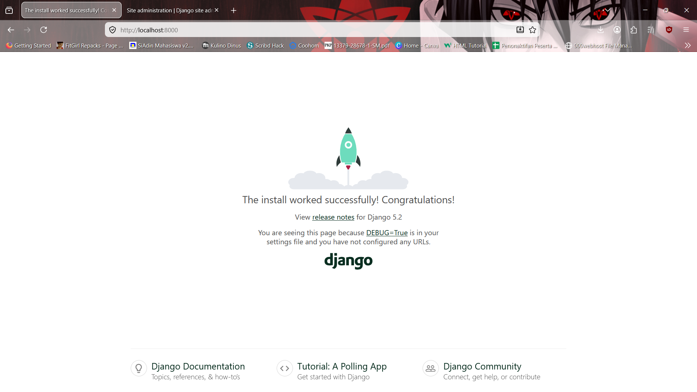
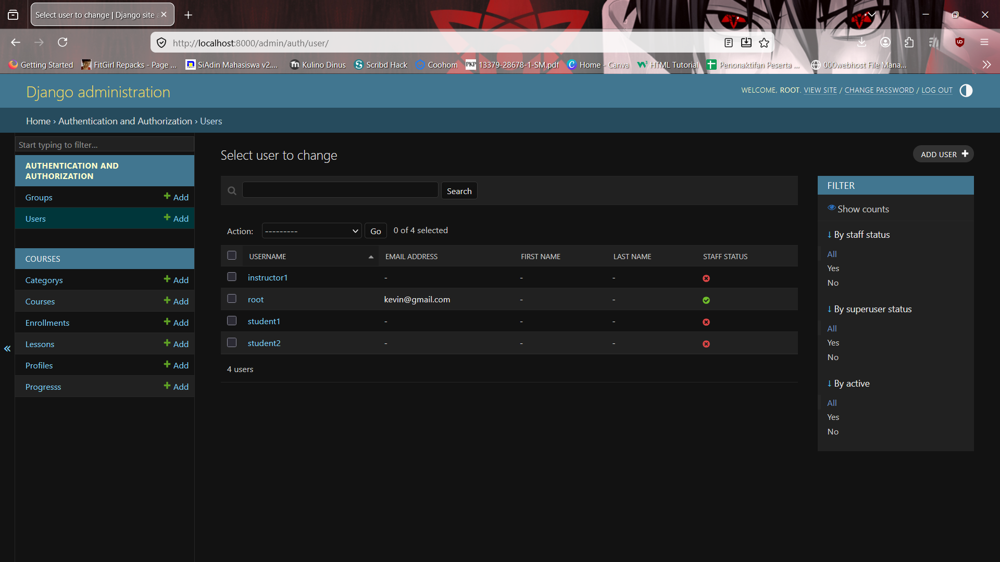
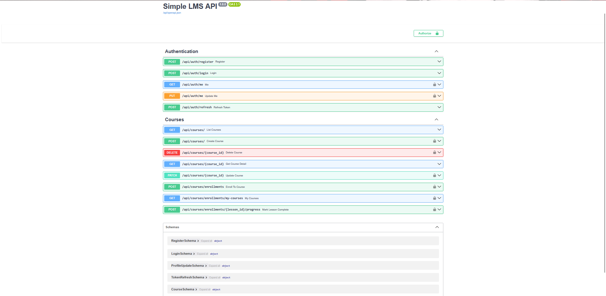

# Progress 1 : Simple LMS - Docker & Django Foundation

## Cara Menjalankan Project
1. Run Environment  File :
'cp .env.example .env'
2. Jalankan Docker :
'docker compose up --build'
3. Migrasi Database :
'docker compose exec web python manage.py migrate'
4. Akses Aplikasi :
http://localhost:8000/
http://localhost:8000/admin/

## Environment variables setup
| Variable    | Keterangan                       |
|-------------|----------------------------------|
| DEBUG       | Mode development (1 = aktif)     |
| SECRET_KEY  | Secret key untuk keamanan Django |
| DB_NAME     | Nama database PostgreSQL         |
| DB_USER     | Username database                |
| DB_PASSWORD | Password database                |
| DB_HOST     | Host database (db dari Docker)   |
| DB_PORT     | Port database (5432)             |

## Screenshot

### Django Welcome Page



---

# Progress 2: Database Design & ORM

## Data Models
- User + Profile (Role)
- Category (hierarchy)
- Course
- Lesson
- Enrollment
- Progress

## Query Optimization

### Tanpa Optimization (N+1 Problem)
Jumlah query: 4

### Dengan Optimization
Jumlah query: 1

## Fixtures
Data awal diexport menggunakan:
docker compose exec web python manage.py dumpdata > fixtures.json

```bash
screenshots/
├── AdminDjango.png
├── course.png
├── query.png
├── profiles.png


# Progress 3: JWT Authentication & RBAC (Role-Based Access Control)

Pada tahap ini, sistem telah dilengkapi dengan sistem keamanan token dan pemisahan akses berdasarkan peran pengguna (**student**, **instructor**, dan **admin**).

## Fitur Baru
* **JWT Authentication**: Login aman menggunakan *Access Token* (60 menit) dan *Refresh Token* (7 hari).
* **Role-Based Access Control (RBAC)**: Pembatasan akses API menggunakan dekorator khusus (`@is_instructor`, `@is_student`).
* **Automated API Documentation**: Dokumentasi interaktif menggunakan Swagger UI melalui Django Ninja.
* **PostgreSQL Integration**: Implementasi database produksi menggunakan PostgreSQL lokal.

## API Endpoints

### Authentication
| Method | Endpoint | Deskripsi |
|:--- |:--- |:--- |
| POST | `/api/auth/register` | Pendaftaran pengguna baru |
| POST | `/api/auth/login` | Mendapatkan JWT Access & Refresh Token |
| GET | `/api/auth/me` | Melihat profil pengguna yang sedang login |

### Courses & Enrollments
| Method | Endpoint | Deskripsi | Proteksi |
|:--- |:--- |:--- |:--- |
| GET | `/api/courses/` | Melihat semua daftar kursus | Public |
| POST | `/api/courses/` | Membuat kursus baru | Instructor Only |
| DELETE | `/api/courses/{id}` | Menghapus kursus tertentu | Owner/Admin |
| POST | `/api/courses/enrollments` | Mendaftar ke kursus | Student Only |
| GET | `/api/courses/enrollments/my-courses` | Daftar kursus yang diikuti | Student Only |

## Screenshot Progress 3

### Swagger API Documentation

